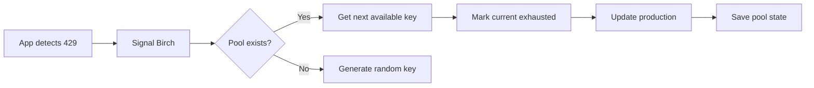

Key pools enable automatic rotation through a collection of pre-configured API keys. When a rate limit is detected, Birch seamlessly switches to the next available key.

## Overview

Key pools are ideal for:
- **Rate-limited APIs** (TikTok, Twitter, etc.)
- **Multi-key strategies** requiring sequential rotation
- **High-availability** services needing backup keys
- **Zero-downtime** key transitions

## How It Works



1. Your app detects a rate limit (HTTP 429)
2. Sends rotation signal to Birch daemon
3. Birch checks if a pool exists for the secret
4. If yes, retrieves the next available key
5. Marks the current key as exhausted
6. Updates the secret in production (.env or cloud)
7. Saves the pool state with updated statistics

## Setting Up a Pool

### Create from Command Line

```bash
# Create with inline keys
birch pool init TIKTOK_API_KEY \
  --keys "sk_prod_abc123,sk_prod_def456,sk_prod_ghi789"
```

### Create from File

Create a text file with one key per line:

```txt
# tiktok-keys.txt
sk_prod_abc123xyz
sk_prod_def456uvw
sk_prod_ghi789rst
sk_prod_jkl012mno

# Comments and empty lines are ignored
```

Then initialize:

```bash
birch pool init TIKTOK_API_KEY --from-file ./tiktok-keys.txt
```

### Verify Pool Creation

```bash
birch pool status TIKTOK_API_KEY
```

Output:
```
Pool: TIKTOK_API_KEY
Status: Ready

Total keys:      4
Available:       4 (100%)
Active:          0
Exhausted:       0

Current index:   0
Last rotation:   Never
```

## Using Pools in Rotation

### Manual Rotation

When you rotate manually, Birch automatically uses the pool:

```bash
birch rotate TIKTOK_API_KEY --env prod --service vercel
```

Output:
```
Using key pool for 'TIKTOK_API_KEY' (3 available, 1 exhausted)
Marked current key as exhausted
Rotating secret 'TIKTOK_API_KEY' in env 'prod'
New value: ***xyz
Warning: Only 2 key(s) remaining in pool!
```

### Automatic Rotation via App Signal

Configure your application to trigger rotation on rate limits:

#### JavaScript/Node.js

```javascript
async function makeApiCall(endpoint, retries = 1) {
  try {
    const response = await fetch(endpoint, {
      headers: {
        'Authorization': `Bearer ${process.env.TIKTOK_API_KEY}`
      }
    });

    if (response.status === 429 && retries > 0) {
      console.log('Rate limit hit, rotating to next key...');
      
      // Trigger rotation via daemon
      await fetch('http://localhost:9123/rotate', {
        method: 'POST',
        headers: { 'Content-Type': 'application/json' },
        body: JSON.stringify({
          secret_name: 'TIKTOK_API_KEY',
          env: 'prod',
          service: 'vercel'
        })
      });

      // Wait for rotation to complete
      await new Promise(resolve => setTimeout(resolve, 2000));
      
      // Retry with new key
      return makeApiCall(endpoint, retries - 1);
    }

    return response.json();
  } catch (error) {
    console.error('API call failed:', error);
    throw error;
  }
}
```

#### Python

```python
import os
import time
import requests
from typing import Optional

def make_api_call(endpoint: str, retries: int = 1) -> Optional[dict]:
    headers = {
        'Authorization': f'Bearer {os.environ["TIKTOK_API_KEY"]}'
    }
    
    response = requests.get(endpoint, headers=headers)
    
    if response.status_code == 429 and retries > 0:
        print('Rate limit hit, rotating to next key...')
        
        # Trigger rotation
        requests.post('http://localhost:9123/rotate', json={
            'secret_name': 'TIKTOK_API_KEY',
            'env': 'prod',
            'service': 'vercel'
        })
        
        # Wait for rotation
        time.sleep(2)
        
        # Retry
        return make_api_call(endpoint, retries - 1)
    
    response.raise_for_status()
    return response.json()
```

#### Go

```go
package main

import (
    "bytes"
    "encoding/json"
    "fmt"
    "io"
    "net/http"
    "os"
    "time"
)

type RotateRequest struct {
    SecretName string `json:"secret_name"`
    Env        string `json:"env"`
    Service    string `json:"service"`
}

func makeAPICall(endpoint string, retries int) ([]byte, error) {
    apiKey := os.Getenv("TIKTOK_API_KEY")
    
    req, _ := http.NewRequest("GET", endpoint, nil)
    req.Header.Set("Authorization", "Bearer "+apiKey)
    
    resp, err := http.DefaultClient.Do(req)
    if err != nil {
        return nil, err
    }
    defer resp.Body.Close()
    
    if resp.StatusCode == 429 && retries > 0 {
        fmt.Println("Rate limit hit, rotating to next key...")
        
        // Trigger rotation
        rotateReq := RotateRequest{
            SecretName: "TIKTOK_API_KEY",
            Env:        "prod",
            Service:    "vercel",
        }
        
        body, _ := json.Marshal(rotateReq)
        http.Post("http://localhost:9123/rotate", "application/json", 
                  bytes.NewBuffer(body))
        
        // Wait for rotation
        time.Sleep(2 * time.Second)
        
        // Retry
        return makeAPICall(endpoint, retries-1)
    }
    
    return io.ReadAll(resp.Body)
}
```

## Managing Pools

### View Pool Status

```bash
# Quick status
birch pool status TIKTOK_API_KEY

# Detailed list with all keys
birch pool list TIKTOK_API_KEY
```

Example output:
```
Pool: TIKTOK_API_KEY
─────────────────────────────────────
0: Exhausted ***abc (last used: 2024-01-15 12:00:00)
1: Exhausted ***def (last used: 2024-01-15 13:15:00)
2: Active ***ghi (last used: 2024-01-15 14:30:22)
3: Available ***jkl
4: Available ***mno
─────────────────────────────────────
Total: 5 keys
Available: 2 | Active: 1 | Exhausted: 2
```

### Add Keys

Add a single key:

```bash
birch pool add TIKTOK_API_KEY --key "sk_prod_new123"
```

Import bulk keys:

```bash
birch pool import TIKTOK_API_KEY --from-file ./new-keys.txt
```

### Remove Keys

Remove exhausted or compromised keys:

```bash
# Remove by index
birch pool remove TIKTOK_API_KEY --index 0

# Remove multiple
for i in 0 1 2; do
  birch pool remove TIKTOK_API_KEY --index 0
done
```

## Pool Storage & Security

### Storage Location

Pools are stored at `~/.birch/pools/<SECRET_NAME>.json`

### Encryption

All keys in the pool are encrypted using **ChaCha20Poly1305**:
- Same encryption key as audit logs
- Nonce is generated per encryption
- Keys stored as base64-encoded ciphertext

### Data Structure

```json
{
  "secret_name": "TIKTOK_API_KEY",
  "keys": [
    {
      "encrypted_value": "base64_encrypted_data",
      "status": "exhausted",
      "last_used": "2024-01-15T14:30:22Z",
      "rate_limit_hit": "2024-01-15T14:30:20Z",
      "usage_count": 127
    }
  ],
  "current_index": 2,
  "last_rotation": "2024-01-15T14:30:22Z"
}
```

## Best Practices

### Pool Sizing

- **Minimum**: 3 keys per pool
- **Recommended**: 5-10 keys for high-traffic APIs
- **Maximum**: Based on your API provider's limits

### Monitoring

Set up alerts for low pool counts:

```bash
#!/bin/bash
# check-pools.sh

SECRETS=("TIKTOK_API_KEY" "TWITTER_API_KEY" "OPENAI_API_KEY")
THRESHOLD=2

for secret in "${SECRETS[@]}"; do
  status=$(birch pool status "$secret" 2>/dev/null)
  if [ $? -eq 0 ]; then
    available=$(echo "$status" | grep "Available:" | awk '{print $2}')
    if [ "$available" -lt "$THRESHOLD" ]; then
      echo "WARNING: LOW POOL - $secret has only $available keys remaining"
      # Send alert (Slack, email, PagerDuty, etc.)
    fi
  fi
done
```

Run via cron:

```bash
# Check pool levels every hour
0 * * * * /path/to/check-pools.sh
```

### Rotation Strategy

1. **Preventive rotation**: Rotate before hitting limits
   ```bash
   # Rotate weekly
   0 0 * * 0 birch rotate TIKTOK_API_KEY --env prod --service vercel
   ```

2. **Reactive rotation**: Let app trigger on 429
   ```javascript
   if (response.status === 429) {
     await triggerRotation();
   }
   ```

3. **Hybrid approach**: Both scheduled + reactive

### Key Lifecycle

1. **Provision**: Add fresh keys to pool
2. **Activate**: Keys become active during rotation
3. **Exhaust**: Marked when rate-limited or rotated
4. **Remove**: Clean up after cooldown period

```bash
# Monthly cleanup of exhausted keys
birch pool list TIKTOK_API_KEY | grep Exhausted | while read -r line; do
  index=$(echo "$line" | cut -d: -f1)
  birch pool remove TIKTOK_API_KEY --index "$index"
done
```

## Troubleshooting

### Pool Exhausted

**Problem**: `No available keys in pool - all keys exhausted`

**Solution**:
```bash
# Check pool status
birch pool status TIKTOK_API_KEY

# Add new keys
birch pool add TIKTOK_API_KEY --key "sk_new_key"

# Or import bulk
birch pool import TIKTOK_API_KEY --from-file ./fresh-keys.txt
```

### Pool Not Found

**Problem**: `Pool for 'SECRET_NAME' does not exist`

**Solution**:
```bash
# Create the pool
birch pool init SECRET_NAME --keys "key1,key2,key3"
```

### Rotation Still Uses Random Generation

**Problem**: Rotation doesn't use pool even though it exists

**Causes**:
1. Pool has no available keys
2. `--value` flag overrides pool
3. Pool file corrupted

**Solution**:
```bash
# Check pool status
birch pool status SECRET_NAME

# List keys and their status
birch pool list SECRET_NAME

# Verify pool file exists
ls -la ~/.birch/pools/SECRET_NAME.json

# Recreate if corrupted
mv ~/.birch/pools/SECRET_NAME.json ~/.birch/pools/SECRET_NAME.json.backup
birch pool init SECRET_NAME --from-file ./keys.txt
```

## Performance Considerations

### Pool Operations

- **Load**: ~1-5ms (decrypt + parse JSON)
- **Save**: ~2-10ms (encrypt + write JSON)
- **Rotation**: ~100-500ms (includes API call)

### Scaling

Pools scale well:
- Up to 100 keys per pool: No performance impact
- 100-500 keys: Minor increase in load time
- 500+ keys: Consider splitting into multiple secrets

### Memory Usage

Each pool uses minimal memory:
- Empty pool: ~200 bytes
- 10 keys: ~2-3 KB
- 100 keys: ~20-30 KB

## Examples

### TikTok API

```bash
# Create pool with 5 TikTok keys
birch pool init TIKTOK_API_KEY --from-file ./tiktok-keys.txt

# Set up daemon for automatic rotation
birch daemon start

# App will automatically rotate on 429
# No manual intervention required
```

### Twitter API

```bash
# Create pool with multiple Twitter bearer tokens
birch pool init TWITTER_BEARER_TOKEN --keys \
  "AAAA...,BBBB...,CCCC..."

# Rotate manually when needed
birch rotate TWITTER_BEARER_TOKEN --env prod --service vercel
```

### OpenAI API

```bash
# Pool of OpenAI API keys
birch pool init OPENAI_API_KEY --keys \
  "sk-proj-xxx,sk-proj-yyy,sk-proj-zzz"

# Monitor usage and rotate before hitting limits
birch pool status OPENAI_API_KEY
```

## Next Steps

- [Configure connectors](/docs/connectors) for your provider
- [Set up the daemon](/docs/usage/app-signals) for automatic rotation
- [Monitor with audit logs](/docs/cli-reference#audit) to track pool usage
- [Read operator runbook](/docs/operators/runbook) for production deployment

